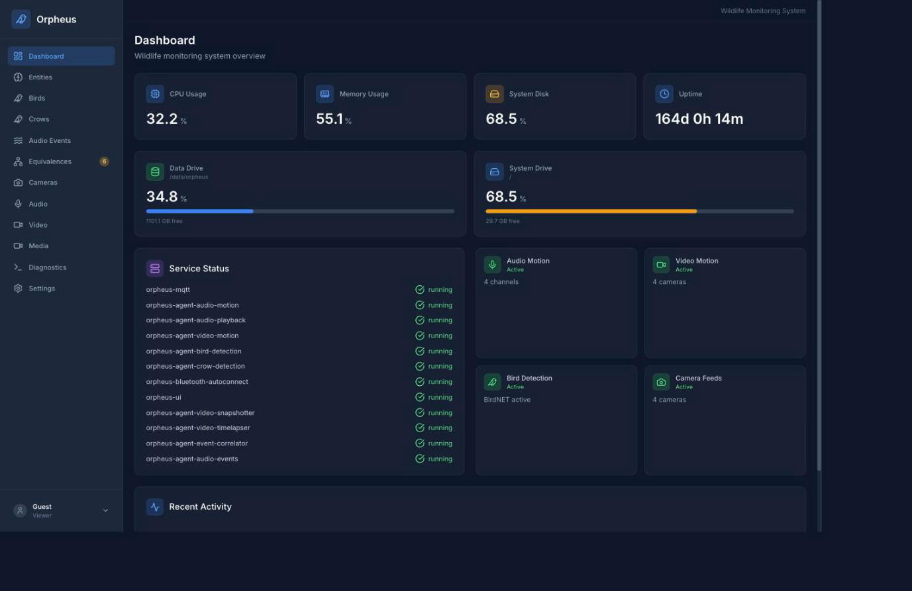
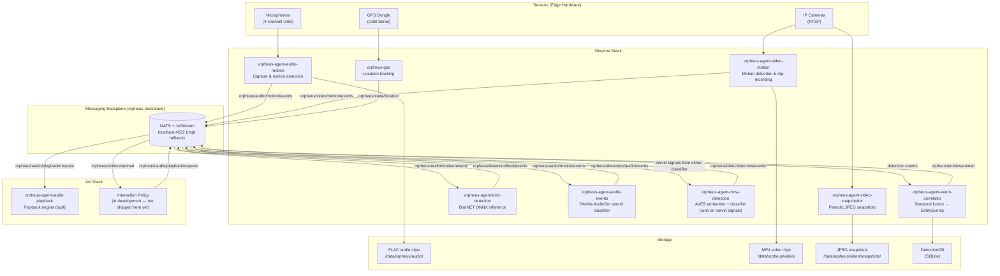

# Orpheus

[](https://github.com/scottchronicity/orpheus/actions/workflows/pr-tests.yml)
[](https://codecov.io/github/scottchronicity/orpheus)
[](https://www.python.org/downloads/)
[](https://opensource.org/licenses/MIT)
[](https://github.com/astral-sh/ruff)
[](http://makeapullrequest.com)

Orpheus listens to a place and tells you what is there. It runs several machine-learning models over live audio and video — a bird specialist, a corvid specialist, a general sound classifier — and reconciles what they each heard into one picture: **one entry per real animal, carrying the evidence that identified it.** It runs on hardware you own, and the recordings stay there.

### Using it responsibly

Orpheus listens to a real place, and with playback wired up it makes sound in one. Anywhere you run it is somebody's habitat. Don't deploy it in protected or sensitive areas, don't let it become a nuisance to your neighbors — human or animal — and use playback deliberately: sound directed at wildlife changes behavior, and it carries further than you expect. Running this software means taking that judgment on yourself.



*A running station — the dashboard on a live deployment.*

### Try it without hardware

The whole collective — capture, all the classifiers, and the correlator — runs in
containers against a synthetic or replayed audio source. You do not need a microphone,
a camera, or a Jetson to watch a real recording become an identified animal.

You need Docker with Compose v2, Git LFS, and about 10 GB of disk. The last step also
runs on your machine rather than in a container, so it needs Python 3.9 — or `uv`, which
will fetch it (`curl -LsSf https://astral.sh/uv/install.sh | sh`). Budget **30 minutes
or so the first time**: the model files are a 1.5 GB download, and the classifier images
build PyTorch and ONNX from scratch. A second run takes minutes, off the cache.

```bash
git clone https://github.com/scottchronicity/orpheus.git && cd orpheus
git lfs install && git lfs pull     # ML models (~1.5 GB)
make sim-up                         # backplane + correlator + synthetic source
make sim-fleet-up                   # the real models
make sim-validate                   # asserts a real clip becomes an entity
make sim-down
```

`make sim-validate` is the payoff: it plays a real recording through BirdNET, the corvid
classifier, and the sound classifier, and asserts the correlator turned them into one
entity. The fleet also exposes the dashboard's API on port 8082 — `curl
localhost:8082/api/config` — but it does not serve the dashboard itself, which needs a
built frontend. To click around the UI, run it locally with `make dev-stack` (see the
[quickstarts](#quickstart)) or install it on real hardware.

Ready for real hardware? Pick a [quickstart](#quickstart) below.

### Documentation

The documentation is published at **<https://scottchronicity.github.io/orpheus/docs/>** —
searchable, and the same tree you get by reading [`docs/`](docs/) in a checkout. Either
way, start at [`docs/index.md`](docs/index.md), which routes you by what you came to do:

| If you want to… | Start here |
| --- | --- |
| Decide whether this is the right tool | [How Orpheus compares](docs/comparison.md) |
| Use the dashboard | [User Guide](docs/user-guide/index.md) |
| Install it yourself | [Installation](docs/INSTALLATION.md) · [with an AI assistant](docs/llm-assisted-install.md) |
| Run it safely | [Security](docs/security.md) · [Operator's Manual](docs/operator-manual/index.md) |
| Understand the data | [Data models](docs/Orpheus_Standard_Data_Models.md) |
| Change how it works | [Architecture](docs/ARCHITECTURE.md) · [Contributing](CONTRIBUTING.md) |
| Work on responding agents or vision | ["I want to work on responding and vision"](docs/index.md) |

See [What's new](docs/whats-new.md) for this release, and the [CHANGELOG](CHANGELOG.md) for the history.

---

## What this is

Orpheus is a closed loop: an agent that observes the place it is in and acts in it, built on [Active Inference](https://www.activeinference.org/) — an agent minimizes surprise by predicting its environment and acting to bring those predictions about. Applied to wildlife, that means hearing a crow call, recognizing it as a specific kind of call from a specific individual, and answering it — not from a script, but from a learned model of the interaction.

The observing side is wired up and running on a Jetson Orin NX at a field site: multi-channel audio 24/7 into BirdNET, a custom AVES-based crow vocalization classifier, and a general sound-event model, reconciled into entity-level events and persisted locally. Recognizing animals by sight goes in next as the system moves further into the field, and contributors are welcome to start on it now.

The acting side runs on the same bus: the playback agent is built and the playback request contract is in place. What this repository does not ship is a *specific responding agent* — the policies that decide what to say, to whom, and when are in active development. Full feedback loops are held to a high bar before they land here, which may keep them out of the public repository for a while. Tools that talk back to animals are worth getting right.

---

## Project Status

| Stack | Status | Description |
| ------- | -------- | ------------- |
| **Observe** | Running in the field | Audio/video capture, ML inference, event correlation, storage |
| **Act** | Playback built; responding agents in development | Audio playback, feeder control, interaction policy |

If you are interested in Active Inference, crow cognition, bioacoustics, or edge ML, the responding side is where the interesting work is. See [GitHub Discussions](https://github.com/scottchronicity/orpheus/discussions) to start a conversation.

---

## Quickstart

| Platform | Guide | Time |
| --- | --- | --- |
| **macOS** (development / demo) | **[macOS Quick Start](docs/MACOS_QUICKSTART.md)** | ~15 min |
| **Jetson Orin NX** (production) | **[Jetson Quick Start](docs/JETSON_QUICKSTART.md)** | ~30 min |
| **Windows** (WSL2, untested) | **[Windows Quick Start](docs/WINDOWS_QUICKSTART.md)** | ~20 min\* |
| **Linux** (dev/demo, untested) | **[Linux Quick Start](docs/LINUX_QUICKSTART.md)** | ~15 min\* |

All guides are self-contained — pick the one for your hardware and go.

\* *The Windows and Linux guides have not yet been verified end-to-end. They're published to give future contributors a starting point — expect rough edges and please open an issue or PR if you hit one.*

---

## Roadmap & What We're Building

Our working philosophy — protect the live field station, earn your domain, hold opinions loosely — is in [CONTRIBUTING](CONTRIBUTING.md#how-we-work-together), and the reasoning behind specific architectural choices lives in the [ADRs](docs/adr/).

Our roadmap lives in [`docs/backlog.json`](https://github.com/scottchronicity/orpheus/blob/main/docs/backlog.json), which seeds the labels, milestones, and issues on [GitHub Issues](https://github.com/scottchronicity/orpheus/issues). It holds outstanding work only — 43 open stories, grouped into eight themes, each theme a milestone:

| Theme | What it covers | Open items |
| ------ | ----------------- | --- |
| **Detection & Identity** | Recognizing what is out there and naming it consistently across classifiers | 6 |
| **Actuation & Response** | Playing sound back into the world, safely, and acting on what the system has learned | 4 |
| **Event Bus** | The transport between agents and the durable stream of what happened | 3 |
| **Dashboard & Interfaces** | What a person looks at, filters, and asks questions through | 6 |
| **Observability** | Knowing what the system itself is doing, and what the weather was while it did it | 3 |
| **Data & Sharing** | Getting recordings and detections out of the station, deliberately and privately | 5 |
| **Infrastructure & Testing** | Build, deploy, configure, simulate, and prove the thing still works | 10 |
| **Edge Hardware** | Surviving a sealed box outdoors on a small computer with a finite disk | 6 |

The counts are open stories, not progress — a short list can mean a theme is nearly done or that it has barely been scoped.

Browse [GitHub Issues](https://github.com/scottchronicity/orpheus/issues) for live tracking. Filter by a milestone for a theme's open work, or by `good first issue` for something small and self-contained to start on.

---

## Architecture

### High-Level Data Flow



### Communication Backbone

All inter-agent communication flows through the local messaging backplane (`orpheus-backplane`: NATS + JetStream by default, mosquitto as the one-line fallback — the `orpheus/...` topic hierarchy is the wire contract on either backend). No agent talks directly to another, so a new analysis agent needs no changes to any existing agent: it subscribes to the topics it cares about and publishes its results. Wiring it into the build, CI, systemd and the manifest generator is a checklist — see [Adding an agent](docs/agent-instructions/30-recipes-adding-agent.md).

The full topic hierarchy:

| Topic Prefix | Purpose |
| --- | --- |
| `orpheus/audio/motion/events` | Raw audio motion triggers from microphones |
| `orpheus/video/motion/events` | Raw video motion triggers from cameras |
| `orpheus/detection/bird/events` | BirdNET species identifications |
| `orpheus/detection/crow/events` | Crow vocalization behavior classifications |
| `orpheus/detection/audio/events` | General sound-event classifications (PANNs / AudioSet) |
| `orpheus/entities/animal` | Correlated entity events (the "animal was here" record) |
| `orpheus/audio/playback/request` | Commands sent to the playback agent |
| `orpheus/state/location` | GPS position (retained) |
| `orpheus/system/{agent}/health` | Per-agent health and liveness |

---

## Repository Structure

```text
orpheus/
├── platform/
│   ├── jetson-orin-nx-yahboom/     # Hardware-specific: ALSA config, GPIO, display, networking
│   └── orpheus-common/             # Shared Python library (config, event bus, logging, storage, DetectionDB)
│
├── agents/                         # Hardware-agnostic detection and analysis agents
│   ├── orpheus-agent-audio-motion/     # Layer 1: Audio energy detection, FLAC recording
│   ├── orpheus-agent-audio-events/     # Layer 2: PANNs AudioSet general sound classifier
│   ├── orpheus-agent-bird-detection/   # Layer 2: BirdNET ONNX species ID
│   ├── orpheus-agent-crow-detection/   # Layer 2: AVES + multi-task crow classifier
│   ├── orpheus-agent-event-correlator/ # Layer 3: Temporal fusion → EntityEvents
│   ├── orpheus-agent-video-motion/     # Layer 1: Camera motion detection, MP4 recording
│   ├── orpheus-agent-video-snapshotter/# Layer 1: Periodic JPEG snapshots
│   ├── orpheus-agent-video-timelapser/ # Layer 3: Timelapse generation from snapshots
│   └── orpheus-agent-audio-playback/   # Act: Plays audio files on a bus request
│
├── services/                       # Hardware-agnostic infrastructure services
│   ├── orpheus-backplane/          # Messaging backplane (NATS+JetStream; mqtt fallback)
│   ├── orpheus_ui/                 # Web UI (FastAPI + React + TypeScript)
│   ├── orpheus-gps/                # GPS location service
│   └── orpheus-bluetooth-autoconnect/ # Bluetooth speaker auto-connection
│
├── make/                           # Shared Makefile includes (deploy, python, lint, service)
├── hardware/                       # Hardware abstraction layer (audio/video device wrappers)
├── artifacts/                      # ML models, recordings, calibration data (Git LFS)
├── tools/                          # Development and deployment utilities
├── docs/                           # Architecture docs, ADRs, component instructions
└── tests/                          # Integration and infrastructure tests
```

### Hardware Isolation

The `agents/` and `services/` directories are **completely hardware-agnostic**. They contain no Jetson-specific code. All hardware-specific configuration (ALSA device aliases, GPIO mappings, display setup, network configuration) lives exclusively in `platform/jetson-orin-nx-yahboom/`.

The shared library at `platform/orpheus-common/` provides the common abstractions — configuration, the event-bus client, logging, storage path helpers, and the DetectionDB — that every agent and service depends on. It too is hardware-agnostic.

This separation means that porting Orpheus to a new single-board computer (e.g., a Raspberry Pi) requires only adding a `platform/raspberry-pi/` directory. The agents themselves do not change. See [CONTRIBUTING.md](CONTRIBUTING.md) for the porting strategy.

---

## Where to start reading

* [`PreRollRingBuffer[T]`](https://github.com/scottchronicity/orpheus/blob/main/platform/orpheus-common/src/orpheus_common/utils/buffer.py) — the ring buffer shared by the audio and video pipelines, sized in seconds rather than raw capacity.
* [`ClusterManager`](https://github.com/scottchronicity/orpheus/blob/main/agents/orpheus-agent-event-correlator/src/orpheus_agent_event_correlator/cluster_manager.py) — groups raw detections into entity-level events.
* [`ChannelProcessor`](https://github.com/scottchronicity/orpheus/blob/main/agents/orpheus-agent-audio-motion/src/orpheus_agent_audio_motion/channel_processor.py) — the per-microphone pipeline composing the two.

## Development Workflow

### Quality Gates

All pull requests must pass:

```bash
make test          # pytest (≥70% coverage enforced by CI)
make lint          # Ruff linting (zero errors)
```

Run these locally before pushing. Cloud CI is expensive.

### CI/CD

GitHub Actions runs path-filtered tests on every PR — only the components affected by the diff are tested, except when `platform/orpheus-common/` changes (which triggers all tests).

Each component has a dedicated test job. The `ci-complete` gate job is the only required status check in branch protection.

Adding a component to CI touches six places — see [CI/CD](docs/agent-instructions/13-ci-cd.md#when-you-add-a-new-component).

---

## How to Contribute

We welcome contributions at every level — from fixing typos to building the Active Inference policy layer.

**Good first issues:** small, self-contained, and genuinely scoped — see the [`good first issue`](https://github.com/scottchronicity/orpheus/labels/good%20first%20issue) label.
**Meaty problems:** visual recognition, the interaction policy, the read-only mirror and public portal, contributing recordings back to the models we use.

Please read [CONTRIBUTING.md](CONTRIBUTING.md) — especially the Python 3.9 constraint — before opening a PR.

For architectural questions and "I want to build X" discussions, use [GitHub Discussions](https://github.com/scottchronicity/orpheus/discussions).

---

## Git LFS

ML models, audio samples, and calibration data are stored in Git LFS. After cloning:

```bash
git lfs install
git lfs pull
```

---

## Security

Please report security vulnerabilities responsibly. See [SECURITY.md](SECURITY.md) for our policy.

---

## License

MIT — see [LICENSE](LICENSE).

## Acknowledgements

Orpheus depends on the work of the bioacoustics and machine-learning research communities:

* **BirdNET:** All bird species classification is powered by the [BirdNET-Analyzer](https://github.com/kahst/BirdNET-Analyzer) by the Cornell Lab of Ornithology and Chemnitz University of Technology.
* **AVES:** Our crow vocalization embedding pipeline uses the [AVES (A Bioacoustic Transformer)](https://github.com/earthspecies/library) foundation model.
* **NVIDIA:** Deep gratitude to the Jetson team for the hardware and JetPack SDK that makes 24/7 on-device inference possible.
* **Community:** Third-party audio samples used for testing and calibration are credited in [artifacts/audio-samples/README.md](https://github.com/scottchronicity/orpheus/blob/main/artifacts/audio-samples/README.md).

---

## Reference

| Document | Purpose |
| --- | --- |
| [docs/](docs/) | The documentation site — start at [`docs/index.md`](docs/index.md) |
| [AGENTS.md](AGENTS.md) | Entry point for AI coding agents (non-negotiables + navigation map) |
| [docs/ARCHITECTURE.md](docs/ARCHITECTURE.md) | Detailed system architecture |
| [docs/adr/](docs/adr/) | Architectural Decision Records |
| [CONTRIBUTING.md](CONTRIBUTING.md) | Contribution guidelines |
| [CHANGELOG.md](CHANGELOG.md) | Release history |

