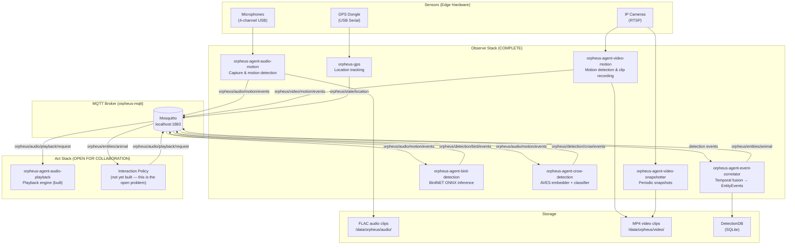

# Orpheus

[](https://github.com/scottchronicity/orpheus/actions/workflows/pr-tests.yml)
[](https://codecov.io/github/scottchronicity/orpheus)
[](https://www.python.org/downloads/)
[](https://opensource.org/licenses/MIT)
[](https://github.com/astral-sh/ruff)
[](http://makeapullrequest.com)

## Wildlife Monitoring & Cross-Species Communication Research Platform

---

## Vision

Most wildlife monitoring stops at observation. A trail camera captures a crow, a database records the sighting, and the interaction ends there. Orpheus is an attempt to go further.

The long-term goal is a platform that doesn't just *watch* — it *listens*, *reasons*, and *responds*. Specifically, we are working toward a system grounded in [Active Inference](https://www.activeinference.org/): the idea that an intelligent agent minimizes surprise by forming predictions about its environment and acting to bring those predictions to fruition. Applied to wildlife, this means building a system that can hear a crow call, recognize it as a specific individual's recruitment call, and generate a contextually appropriate audio reply — not by scripting responses, but by learning a generative model of the interaction.

This is ambitious. We are doing it incrementally, in the open, with real hardware deployed in the field.

---

## Project Status

This repository is organized around two conceptual stacks. Their current status is explicit:

| Stack | Status | Description |
| ------- | -------- | ------------- |
| **Observe** | **Complete** | Audio/video capture, ML inference, event correlation, storage |
| **Act** | **Open for collaboration** | Audio playback, feeder control, adaptive interaction logic |

The **Observe** stack is fully operational on a Jetson Orin NX deployed at a field site. It is capturing multi-channel audio 24/7, running BirdNET and a custom AVES-based crow vocalization classifier, correlating detections into entity-level events, and persisting everything to a local database.

The **Act** stack infrastructure exists (see `agents/orpheus-agent-audio-playback/` and `services/orpheus-bluetooth-autoconnect/`), but the *intelligence* — the policy that decides *when* and *what* to play back in response to a detection — has not been built. This is where we want the community's help. If you are interested in Active Inference, crow cognition, bioacoustics, or edge ML, this is the open problem.

See [GitHub Discussions](https://github.com/scottchronicity/orpheus/discussions) to start a conversation.

---

## Engineering Highlights

A few pieces of the codebase worth reading if you want to understand the platform's design sensibility:

### `PreRollRingBuffer[T]` — [platform/orpheus-common/src/orpheus_common/utils/buffer.py](platform/orpheus-common/src/orpheus_common/utils/buffer.py)

A type-generic ring buffer parameterized by `max_seconds` and `items_per_second` rather than raw capacity. The same class serves both the audio pipeline (byte chunks) and the video pipeline (frames) without duplication. Its `get_snapshot(exclude_last=True)` method addresses the off-by-one problem inherent to triggered pre-roll: when a detection fires, you may want the buffer contents *before* the triggering frame — not including it. That parameter carries the full intent of the design.

### `ClusterManager` — [agents/orpheus-agent-event-correlator/src/orpheus_agent_event_correlator/cluster_manager.py](agents/orpheus-agent-event-correlator/src/orpheus_agent_event_correlator/cluster_manager.py)

The temporal fusion engine that groups raw detections into entity-level events. Each species gets a per-cluster sliding-window timer: every new observation cancels the existing timer and schedules a fresh one. When the window expires without new observations, it emits a single `EntityEvent` that aggregates all evidence — confidence scores, sensor IDs, clip paths — into one record. The key insight is using `call_soon_threadsafe()` to keep all timer manipulation on the asyncio event loop thread, even though MQTT callbacks arrive from a different thread. Most implementations reach for a background sweep task; this one is cleaner and self-contained.

### `ChannelProcessor` — [agents/orpheus-agent-audio-motion/src/orpheus_agent_audio_motion/channel_processor.py](agents/orpheus-agent-audio-motion/src/orpheus_agent_audio_motion/channel_processor.py)

The per-microphone detection pipeline that composes the two pieces above. It appends each incoming frame to the pre-roll buffer *before* running the motion detector, guaranteeing the triggering frame is always captured regardless of detector timing. When motion fires, it prepends the buffered pre-roll to the new clip — giving downstream classifiers the full context window they need. The detector and the buffer are completely decoupled; the processor is the thin, explicit composition layer between them.

---

## Roadmap & What We're Building

Our governing philosophy is laid out in the [Open Source Roadmap](docs/OPEN_SOURCE_ROADMAP_v1.md) — start there if you want to understand *why* we make the choices we make.

Our roadmap was seeded from [`docs/backlog.json`](docs/backlog.json), which defines the Epics, labels, and sub-issues tracked in [GitHub Issues](https://github.com/scottchronicity/orpheus/issues). All major architectural work is organized into **9 Epics**, each representing a significant capability leap for the platform:

| # | Epic | What It Unlocks |
| --- | ------ | ----------------- |
| 1 | **The Cognitive Holarchy** | Multi-entity taxonomy, temporal memory, self-awareness |
| 2 | **Universal Actuation (MCP)** | Safe hardware control via Model Context Protocol |
| 3 | **Interspecies Interfaces** | Voice control, mobile alerts, privacy filtering |
| 4 | **Event Bus Evolution** | Durable, replayable streams beyond MQTT |
| 5 | **Observability & Telemetry** | Weather integration, OpenTelemetry migration |
| 6 | **Infrastructure & Extensibility** | DRY Makefiles, BATS testing, package management |
| 7 | **Containerization & Simulation** | Full-stack Docker dev environment — no hardware needed |
| 8 | **Configuration Management** | Versioned, database-backed config with env overrides |
| 9 | **Edge Hardware Realities** | Thermal management and acoustic regression testing |

Head to the [GitHub Issues](https://github.com/scottchronicity/orpheus/issues) tab to see live tracking issues for each Epic and their sub-tasks. Filter by `type: epic` for the big picture, or `good first issue` if you want to jump in right now.

---

## Architecture

### High-Level Data Flow



### Communication Backbone

All inter-agent communication flows through a local Mosquitto MQTT broker on `localhost:1883`. No agent talks directly to another. This makes the system trivially extensible: a new analysis agent subscribes to the topics it cares about and publishes its results — no changes required elsewhere.

The full topic hierarchy:

| Topic Prefix | Purpose |
| --- | --- |
| `orpheus/audio/motion/events` | Raw audio motion triggers from microphones |
| `orpheus/video/motion/events` | Raw video motion triggers from cameras |
| `orpheus/detection/bird/events` | BirdNET species identifications |
| `orpheus/detection/crow/events` | Crow vocalization behavior classifications |
| `orpheus/entities/animal` | Correlated entity events (the "animal was here" record) |
| `orpheus/audio/playback/request` | Commands sent to the playback agent |
| `orpheus/state/location` | GPS position (retained) |
| `orpheus/system/{agent}/health` | Per-agent health and liveness |

---

## Repository Structure

```text
orpheus/
├── platform/
│   ├── jetson-orin-nx-yahboom/     # Hardware-specific: ALSA config, GPIO, display, networking
│   └── orpheus-common/             # Shared Python library (config, MQTT, logging, storage, DetectionDB)
│
├── agents/                         # Hardware-agnostic detection and analysis agents
│   ├── orpheus-agent-audio-motion/     # Layer 1: Audio energy detection, FLAC recording
│   ├── orpheus-agent-bird-detection/   # Layer 2: BirdNET ONNX species ID
│   ├── orpheus-agent-crow-detection/   # Layer 2: AVES + multi-task crow classifier
│   ├── orpheus-agent-event-correlator/ # Layer 3: Temporal fusion → EntityEvents
│   ├── orpheus-agent-video-motion/     # Layer 1: Camera motion detection, MP4 recording
│   ├── orpheus-agent-video-snapshotter/# Layer 1: Periodic JPEG snapshots
│   ├── orpheus-agent-video-timelapser/ # Layer 3: Timelapse generation from snapshots
│   └── orpheus-agent-audio-playback/   # Act: Plays audio files via MQTT command
│
├── services/                       # Hardware-agnostic infrastructure services
│   ├── orpheus-mqtt/               # Mosquitto MQTT broker configuration
│   ├── orpheus-dashboard/          # Legacy diagnostic web UI (FastAPI + vanilla JS)
│   ├── orpheus_ui/                 # Modern web UI (FastAPI + React + TypeScript)
│   ├── orpheus-gps/                # GPS location service
│   └── orpheus-bluetooth-autoconnect/ # Bluetooth speaker auto-connection
│
├── make/                           # Shared Makefile includes (deploy, python, lint, service)
├── hardware/                       # Hardware abstraction layer (audio/video device wrappers)
├── artifacts/                      # ML models, recordings, calibration data (Git LFS)
├── tools/                          # Development and deployment utilities
├── docs/                           # Architecture docs, ADRs, component instructions
└── tests/                          # Integration and infrastructure tests
```

### Key Design Principle: Hardware Isolation

The `agents/` and `services/` directories are **completely hardware-agnostic**. They contain no Jetson-specific code. All hardware-specific configuration (ALSA device aliases, GPIO mappings, display setup, network configuration) lives exclusively in `platform/jetson-orin-nx-yahboom/`.

The shared library at `platform/orpheus-common/` provides the common abstractions — configuration, MQTT client, logging, storage path helpers, and the DetectionDB — that every agent and service depends on. It too is hardware-agnostic.

This separation means that porting Orpheus to a new single-board computer (e.g., a Raspberry Pi) requires only adding a `platform/raspberry-pi/` directory. The agents themselves do not change. See [CONTRIBUTING.md](CONTRIBUTING.md) for the porting strategy.

---

## Quickstart

| Platform | Guide | Time |
| --- | --- | --- |
| **macOS** (development / demo) | **[macOS Quick Start](docs/MACOS_QUICKSTART.md)** | ~15 min |
| **Jetson Orin NX** (production) | **[Jetson Quick Start](docs/JETSON_QUICKSTART.md)** | ~30 min |

Both guides are self-contained — pick the one for your hardware and go.

---

## Development Workflow

### Quality Gates

All pull requests must pass:

```bash
make test          # pytest (≥70% coverage enforced by CI)
make lint          # Ruff linting (zero errors)
```

Run these locally before pushing. Cloud CI is expensive.

### CI/CD

GitHub Actions runs path-filtered tests on every PR — only the components affected by the diff are tested, except when `platform/orpheus-common/` changes (which triggers all tests).

Each component has a dedicated test job. The `ci-complete` gate job is the only required status check in branch protection.

#### Adding a New Component to CI

1. Add a `Makefile` with `install`, `lint`, and `coverage` targets
2. Add a path filter and test job to `.github/workflows/pr-tests.yml`
3. Add the job to the `ci-complete` gate's `needs` list

---

## How to Contribute

We welcome contributions at every level — from fixing typos to building the Active Inference policy layer.

**Good first issues:** agent README improvements, test coverage increases, configuration documentation
**Meaty problems:** the Act stack interaction policy, multi-station coordination, a web-based annotation tool for recorded clips

Please read [CONTRIBUTING.md](CONTRIBUTING.md) — especially the Python 3.9 constraint — before opening a PR.

For architectural questions and "I want to build X" discussions, use [GitHub Discussions](https://github.com/scottchronicity/orpheus/discussions).

---

## Git LFS

ML models, audio samples, and calibration data are stored in Git LFS. After cloning:

```bash
git lfs install
git lfs pull
```

---

## Security

Please report security vulnerabilities responsibly. See [SECURITY.md](SECURITY.md) for our policy.

---

## License

MIT — see [LICENSE](LICENSE).

## Acknowledgements

Orpheus is made possible by the incredible work of the bioacoustics and machine learning research communities:

* **BirdNET:** All bird species classification is powered by the [BirdNET-Analyzer](https://github.com/kahst/BirdNET-Analyzer) by the Cornell Lab of Ornithology and Chemnitz University of Technology.
* **AVES:** Our crow vocalization embedding pipeline utilizes the [AVES (A Bioacoustic Transformer)](https://github.com/earthspecies/library) foundation model.
* **NVIDIA:** Deep gratitude to the Jetson team for the hardware and JetPack SDK that makes 24/7 on-device inference possible.
* **Community:** Third-party audio samples used for testing and calibration are credited in [artifacts/audio-samples/README.md](artifacts/audio-samples/README.md).

---

## Documentation

| Document | Purpose |
| --- | --- |
| [CODING_AGENT_CONTEXT.md](CODING_AGENT_CONTEXT.md) | Single source of truth for development standards and patterns |
| [docs/ARCHITECTURE.md](docs/ARCHITECTURE.md) | Detailed system architecture |
| [docs/adr/](docs/adr/) | Architectural Decision Records (9 decisions) |
| [make/](make/) | Shared Makefile includes (deploy, python, lint, service) |
| [CONTRIBUTING.md](CONTRIBUTING.md) | Contribution guidelines |

---

*Built for wildlife research — designed to listen, reason, and respond.*
