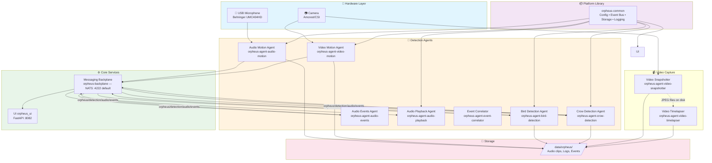
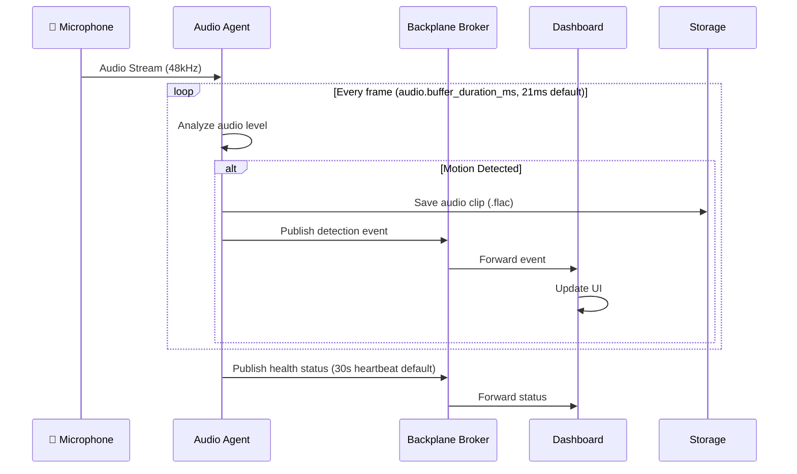
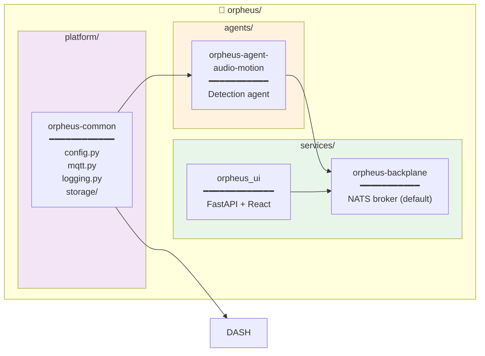
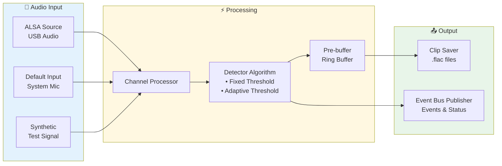
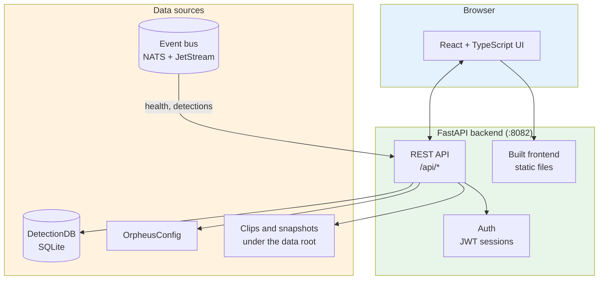
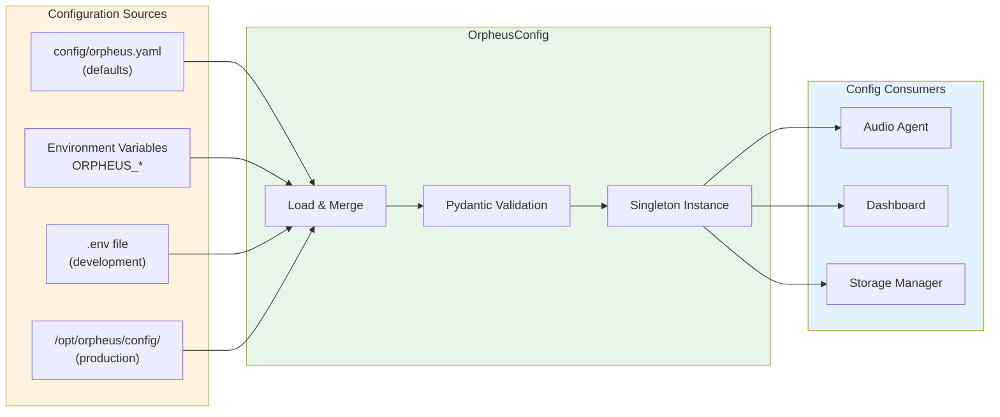
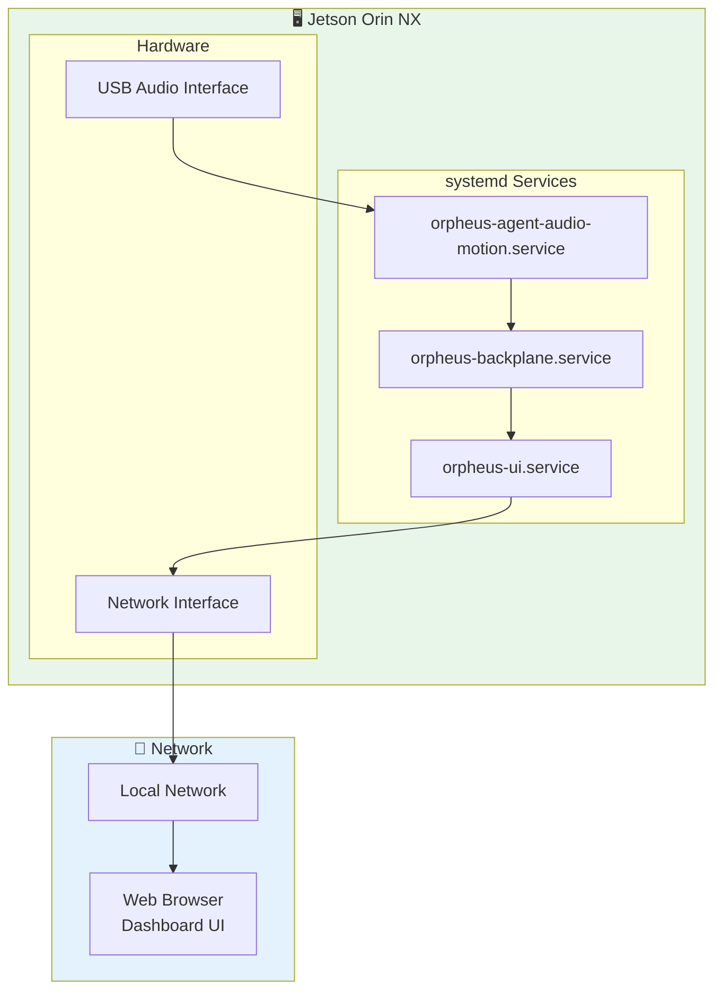
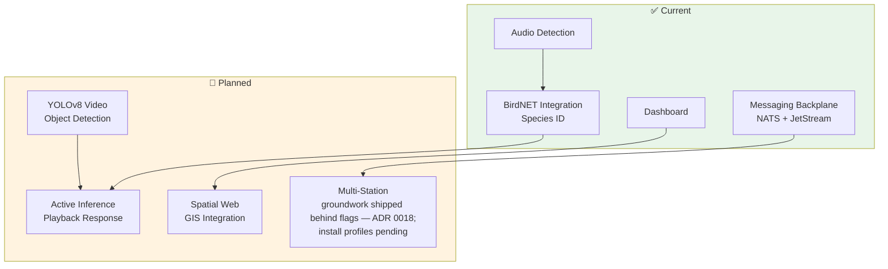

# Orpheus Architecture

This document describes the high-level architecture of the Orpheus wildlife monitoring and cross-species communication platform.

## Overview

Orpheus is a Python monorepo designed for real-time wildlife monitoring on edge computing hardware (NVIDIA Jetson Orin NX). The platform follows a modular, service-oriented architecture that enables:

- **Real-time audio/video processing** with low-latency ML inference
- **Distributed agent communication** via a messaging backplane (NATS + JetStream by default; mosquitto/MQTT as the fallback — see [ADR 0017](adr/0017-actor-model-nats-backplane.md))
- **Edge deployment** on resource-constrained hardware
- **Cross-platform development** (macOS for development, ARM Linux for production)

## System Architecture



Solid edges are event-bus subscriptions — no agent calls another directly.
The dashed edge is a filesystem handoff: the snapshotter writes JPEGs and the
timelapser reads them, with no bus involvement (ADR 0002).

## Data Flow



## Component Architecture

### Monorepo Structure



## Platform Constraints

| Constraint | Requirement |
| ------------ | ------------- |
| **Target Hardware** | NVIDIA Jetson Orin NX (ARM) |
| **Python Version** | 3.9.5 (locked for Jetson compatibility) |
| **Development Platforms** | macOS (Apple Silicon), Ubuntu |
| **ML Framework** | PyTorch + CUDA (crow-detection, audio-events); ONNX Runtime on CPU (bird-detection); TFLite for BirdNET's geo-filter |

## Audio Processing Pipeline



## Dashboard Architecture

The dashboard is `services/orpheus_ui`: a React + TypeScript frontend built with
Vite, served as static files by a FastAPI backend that also exposes the API. The
backend reads the detection database directly and subscribes to the event bus for
live health and detection updates.



The backend can be pointed at a read-only replica instead of the live database
(`ui.read_from_replica`), so history browsing reads a snapshot rather than the
database the agents are writing to.

## BUS Topic Structure

The `orpheus/...` hierarchy below is the wire contract on either backend: NATS
(default) mirrors it as subjects; the mosquitto fallback uses it as literal BUS
topics.

```mermaid
graph TD
    ROOT[orpheus/]
    
    ROOT --> AUDIO[audio/]
    ROOT --> DETECTION[detection/]
    ROOT --> ENTITIES[entities/]
    ROOT --> SYSTEM[system/]
    ROOT --> VIDEO[video/]
    
    AUDIO --> A_EVENTS[motion/events<br/>Audio motion events]
    AUDIO --> A_STATUS[motion/status<br/>Channel status]
    AUDIO --> A_PLAYBACK[playback/request<br/>Playback requests]
    
    DETECTION --> D_BIRD[bird/events<br/>BirdNET detections]
    DETECTION --> D_CROW[crow/events<br/>Crow detections]
    DETECTION --> D_AUDIO[audio/events<br/>PANNs sound-event detections]
    
    ENTITIES --> E_ANIMAL[animal<br/>Correlated entity events]
    
    SYSTEM --> S_HEALTH[*/health<br/>Agent health]
    SYSTEM --> S_CONFIG[config_changed<br/>Config changes]
    SYSTEM --> S_SAFETY[safety<br/>Circuit-breaker state]
    DETECTION --> D_REPLAY[replay<br/>Replayed detections]
    STATE[state/] --> S_LOC[location<br/>GPS fix, retained]
    ENV[environment/] --> WX[weather<br/>Ecowitt readings — stubbed]
    ACT[actuation/] --> A_PB[audio/playback<br/>Playback windows]
    EU[entity-updates/] --> EU_A[animal<br/>Late-arrival enrichment]
    
    VIDEO --> V_EVENTS[motion/events<br/>Motion events]
    VIDEO --> V_STATUS[motion/status<br/>Camera status]

    style ROOT fill:#1565c0,color:#fff
    style AUDIO fill:#2196f3,color:#fff
    style DETECTION fill:#9c27b0,color:#fff
    style ENTITIES fill:#c2185b,color:#fff
    style SYSTEM fill:#4caf50,color:#fff
    style VIDEO fill:#ff9800,color:#fff
```



## Configuration Flow



## Deployment Architecture



## Directory Structure

```bash
orpheus/
├── platform/
│   └── orpheus-common/       # Shared platform library
│       ├── src/orpheus_common/
│       │   ├── config.py     # Configuration management
│       │   ├── event_bus.py  # EventBus ABC + factory
│       │   ├── event_bus_nats.py # NATS + JetStream backend
│       │   ├── mqtt.py       # mosquitto fallback backend
│       │   ├── actor/         # Actor base every agent subclasses
│       │   ├── detection/     # Detection, Entity, DetectionDB, taxonomy
│       │   ├── logging.py    # Structured logging
│       │   ├── storage/      # File storage utilities
│       │   ├── hardware/     # Hardware abstraction
│       │   └── diagnostics/  # Health monitoring
│       └── tests/
│
├── services/
│   ├── orpheus-backplane/    # Messaging backplane (NATS default; mosquitto fallback)
│   │   ├── config/
│   │   ├── scripts/
│   │   └── systemd/
│   │
│   ├── orpheus-gps/          # GPS time + location service
│   ├── orpheus-bluetooth-autoconnect/  # Audio-out routing
│   ├── orpheus-dashboard/    # RETIRED — superseded by orpheus_ui; not deployed
│   └── orpheus_ui/           # Web-based UI
│       ├── backend/          # FastAPI backend (port 8082)
│       ├── frontend/         # React + Vite frontend (port 5173 dev)
│       └── systemd/
│
├── agents/
│   ├── orpheus-agent-audio-motion/  # Audio motion detection agent
│   │   ├── src/orpheus_agent_audio_motion/
│   │   │   ├── main.py               # Agent entrypoint
│   │   │   ├── audio_source.py       # Audio capture backends
│   │   │   ├── detector_algorithm.py # Detection algorithms
│   │   │   └── channel_processor.py  # Per-channel processing
│   │   └── tests/
│   │
│   ├── orpheus-agent-video-motion/  # Video motion detection agent
│   │   ├── src/orpheus_agent_video_motion/
│   │   │   ├── main.py               # Agent entrypoint
│   │   │   ├── video_source.py       # RTSP stream capture
│   │   │   └── motion_detector.py    # Motion detection
│   │   └── tests/
│   │
│   ├── orpheus-agent-bird-detection/  # BirdNET species identification
│   │   ├── src/orpheus_agent_bird_detection/
│   │   │   ├── main.py               # Agent entrypoint
│   │   │   └── birdnet_model.py      # BirdNET ONNX inference
│   │   └── tests/
│   │
│   ├── orpheus-agent-crow-detection/  # Crow vocalization analysis
│   │   ├── src/orpheus_agent_crow_detection/
│   │   │   ├── main.py               # Agent entrypoint
│   │   │   ├── embedder.py           # AVES embedder (16kHz)
│   │   │   └── classifier.py         # Multi-task classifier
│   │   └── tests/
│   │
│   ├── orpheus-agent-audio-events/    # General AudioSet sound classification
│   │   ├── src/orpheus_agent_audio_events/
│   │   │   ├── main.py               # Agent entrypoint
│   │   │   ├── model.py              # PANNs sound-event detection
│   │   │   ├── post_processing.py    # Frames → temporal intervals
│   │   │   └── audioset_ontology.py  # AudioSet 527-class ontology
│   │   └── tests/
│   │
│   ├── orpheus-agent-audio-playback/  # Audio output agent
│   │   ├── src/orpheus_agent_audio_playback/
│   │   │   ├── main.py               # Agent entrypoint
│   │   │   └── playback.py           # Audio playback manager
│   │   └── tests/
│   │
│   ├── orpheus-agent-video-snapshotter/  # Periodic camera snapshots
│   │   ├── src/orpheus_agent_video_snapshotter/
│   │   │   ├── main.py               # Agent entrypoint
│   │   │   └── config.py             # Configuration loading
│   │   └── tests/
│   │
│   ├── orpheus-agent-video-timelapser/  # Timelapse generation
│   │   ├── src/orpheus_agent_video_timelapser/
│   │   │   ├── main.py               # Agent entrypoint
│   │   │   └── config.py             # Configuration loading
│   │   └── tests/
│   │
│   └── orpheus-agent-event-correlator/  # Fuses detections into entities
│       ├── src/orpheus_agent_event_correlator/
│       │   ├── main.py               # Agent entrypoint
│       │   └── cluster_manager.py    # Same-source grouping
│       └── tests/
│
├── config/                   # orpheus.example.yaml — every knob, with comments
├── deploy/                   # host-level drop-ins (journald log bounds)
├── docker/                   # Dockerfiles + the Simulacrum's sim-source
├── scripts/                  # dev-stack and other developer scripts
├── hardware/                 # Hardware-specific configurations
├── artifacts/                # ML models, recordings (Git LFS)
├── tools/                    # Development utilities
└── docs/                     # Documentation
```

## Configuration

Configuration is managed through a layered system:

1. **Base Config**: `config/orpheus.yaml` (defaults)
2. **Environment Override**: `ORPHEUS_*` environment variables
3. **Local Override**: `.env` files (development)
4. **Instance Config**: `/opt/orpheus/config/orpheus.yaml` (production)

```yaml
# Example orpheus.yaml structure
audio:
  channels:
    - id: mic_1
      device: alsa://orpheus_umc?channel=1
      enabled: true
      detection:
        algorithm: adaptive_threshold
        threshold_db: -40.0

event_bus:
  backend: "nats"          # nats (default) | mqtt
  nats_url: "nats://127.0.0.1:4222"

audio:
  channels:
    - id: 1
      enabled: true

storage:
  base_path: /data/orpheus
  retention:
    sweep_enabled: true
```

## Agents

The Orpheus platform uses a layered agent architecture where Layer 1 agents detect motion/activity, and Layer 2 agents perform specialized analysis.

### Layer 1: Motion Detection

#### Audio Motion Detection (`orpheus-agent-audio-motion`)

- **Purpose:** Detect audio activity above threshold across 4 microphone channels
- **Input:** Raw audio from Behringer UMC404HD (48kHz, 4 channels)
- **Output:** Audio clips + motion events via `orpheus/audio/motion/events`
- **Algorithm:** Fixed or adaptive threshold detection with pre-buffering
- **Storage:** FLAC audio clips in `/data/orpheus/audio/audio_motion/{channel}/`

#### Video Motion Detection (`orpheus-agent-video-motion`)

- **Purpose:** Detect visual motion in camera feeds
- **Input:** RTSP streams from 4 Amcrest IP cameras
- **Output:** Motion events + video clips via `orpheus/video/motion/events`
- **Algorithm:** Frame differencing with configurable sensitivity
- **Storage:** MP4 video clips in `/data/orpheus/video/video_motion/{camera}/`

### Layer 2: Specialized Analysis

#### Bird Detection (`orpheus-agent-bird-detection`)

- **Purpose:** Identify bird species from audio clips
- **Model:** BirdNET ONNX (species classification)
- **Input:** Audio motion events from `orpheus/audio/motion/events`
- **Output:** Species detections via `orpheus/detection/bird/events`
- **Data Format:**

  ```json
  {
    "event_id": "bird_det_...",
    "timestamp": "2025-12-05T22:35:58Z",
    "channel_id": "1",
    "detections": [
      {
        "species_code": "amecro",
        "species_common": "American Crow",
        "confidence": 0.92,
        "start_time": 1.2,
        "end_time": 3.5
      }
    ],
    "audio_clip_path": "/data/orpheus/audio/..."
  }
  ```

#### Crow Detection (`orpheus-agent-crow-detection`)

- **Purpose:** Detailed crow vocalization analysis (species, call type, quality)
- **Models:**
  - AVES embedder (aves-base-bio.pt): 16kHz audio → 768-dim embeddings
  - Multi-task classifier (mt_70.pt): species, call type, quality prediction
- **Input:** corvid signals from *either* upstream classifier —
  `orpheus/detection/bird/events` (BirdNET naming a corvid) and
  `orpheus/detection/audio/events` (an AudioSet "Crow"/"Caw" tag). It does **not**
  subscribe to raw audio motion: the expensive AVES pass runs only on clips another
  model already flagged, deduped by clip path within a 30-second window so a second
  flag on the same clip does not start a second pass.
- **Processing:** Resample 48kHz → 16kHz, extract embeddings, classify
- **Output:** Crow detections via `orpheus/detection/crow/events`
- **Data Format:**

  ```json
  {
    "event_id": "crow_det_...",
    "timestamp": "2025-12-05T22:35:58Z",
    "channel_id": "1",
    "detection": {
      "species": "american_crow",
      "call_type": "caw",
      "quality_score": 0.87
    },
    "audio_clip_path": "/data/orpheus/audio/...",
    "inference_time_ms": 145
  }
  ```

- **Storage:** Detections stored in DetectionDB (SQLite) at `/data/orpheus/detections/`

#### Audio Events (`orpheus-agent-audio-events`)

- **Purpose:** Tag everything else in the clip — dog barks, vehicles, voices, rain —
  and say *when* in the clip each sound occurred
- **Model:** PANNs `Cnn14_DecisionLevelMax` over the AudioSet 527-class ontology,
  with native frame-level (10 ms) outputs
- **Input:** Audio motion events from `orpheus/audio/motion/events`
- **Processing:** Resample to 32 kHz mono, run sound-event detection, post-process
  frames into intervals, emit one `Detection` per surviving label
- **Output:** Sound-event detections via `orpheus/detection/audio/events`
- **Data Format:** one `Detection(detection_type="audio.classified")` per label,
  carrying an `audioset` taxonomy reference (`/m/...` machine ID) per
  [ADR 0011](adr/0011-temporal-localisation-and-taxonomy-references.md), a
  `species_code` of `audioset_<machine_id>`, and `intervals` of
  `TemporalInterval(start_seconds, end_seconds, confidence)`

This is the third model in the audio chain: bird-detection and crow-detection answer
"which bird, and what was it doing"; audio-events answers "what else was there". The
correlator reconciles all three into one entity.

### Layer 2.5: Fusion

#### Event Correlator (`orpheus-agent-event-correlator`)

The agent that turns three independent detection streams into one row per
animal. Nothing else produces entities.

- **Purpose:** group observations that came from the same source — overlapping
  in-clip intervals, labels that denote the same thing — into a single entity
  carrying every classifier's evidence.
- **Input:** the detection subjects named in `correlation.input_topics`;
  it processes `species.detected`, `crow.analyzed` and `audio.classified`.
- **Output:** `orpheus/entities/animal`, plus `orpheus/entity-updates/animal`
  for late-arriving evidence. With `publish_entity_type_topics` on, entities also
  route by type (`orpheus/entities/animal/bird/crow`).
- **See:** [ADR 0013](adr/0013-source-identity-entities.md) for what merge keys
  on, and [ADR 0016](adr/0016-entity-type-taxonomy.md) for the type taxonomy.

### Layer 3: Output

#### Audio Playback (`orpheus-agent-audio-playback`)

- **Purpose:** Play audio responses via system speakers
- **Input:** Playback requests from `orpheus/audio/playback/request`
- **Output:** Audio via default ALSA output device
- **Features:** Sound registry, repeat counts, pause between repeats
- **Use Cases:** Wildlife callbacks, alert sounds, test signals

### Video Capture & Processing

These agents handle video data capture and processing, independent of the motion detection layer.

#### Video Snapshotter (`orpheus-agent-video-snapshotter`)

- **Purpose:** Capture periodic still images from IP cameras
- **Input:** RTSP streams from configured cameras
- **Output:** JPEG files in `/data/orpheus/video/snapshots/{YYYY.MM.DD}/`
- **Configuration:** Per-camera intervals (e.g., `5m`, `10m`)
- **Design:** On-demand RTSP connections minimize resource usage
- **See:** [ADR 0002: Video Snapshot Architecture](adr/0002-video-snapshot-architecture.md)

#### Video Timelapser (`orpheus-agent-video-timelapser`)

- **Purpose:** Generate timelapse videos from snapshots
- **Input:** JPEG snapshots from snapshotter
- **Output:** H.264 MP4 videos in `/data/orpheus/video/timelapses/{YYYY.MM.DD}/`
- **Tiers:** Multiple lookback windows (24h, 12h, 6h, 1h, 30m, 10m)
- **Encoding:** mp4v + ffmpeg transcode for Jetson compatibility
- **Filename Format:** `{camera}.{label}.{tier}.{lookback}.{timestamp}.mp4`
- **See:** [ADR 0003: Timelapse Generation Architecture](adr/0003-timelapse-generation-architecture.md)
- **See:** [ADR 0004: Jetson Video Codec Strategy](adr/0004-jetson-video-codec-strategy.md)

## Development Workflow

```mermaid
graph LR
    subgraph Dev["💻 Development (Mac)"]
        CODE[Write Code]
        TEST[make test]
        LINT[make lint]
        FMT[make format]
    end

    subgraph CI["🔄 CI/CD"]
        PR[Pull Request]
        GHA[GitHub Actions]
        COV[Coverage Check]
    end

    subgraph Prod["🚀 Production (Jetson)"]
        DEPLOY[make services-install]
        START[make services-start]
        LOGS[make service-logs]
    end

    CODE --> TEST
    TEST --> LINT
    LINT --> FMT
    FMT --> PR
    PR --> GHA
    GHA --> COV
    COV --> DEPLOY
    DEPLOY --> START
    START --> LOGS

    style Dev fill:#e3f2fd
    style CI fill:#fff3e0
    style Prod fill:#e8f5e9
```



## Testing Strategy

- **Unit Tests**: Per-component with pytest
- **Coverage Target**: 70% for most components, with `orpheus-common` at 78% and
  `audio-motion` at 72%. `codecov.yml` is the source of truth; the CI thresholds
  live in the `env:` block of `.github/workflows/pr-tests.yml`.
- **CI/CD**: GitHub Actions on push/PR
- **Platform Tests**: Separate workflows for ARM validation

## Future Architecture



## Contributing

When contributing, ensure:

1. Changes work on Python 3.9.5 (Jetson constraint)
2. No dependencies incompatible with ARM architecture
3. Tests pass with `make test`
4. Code is linted with `ruff`
5. Documentation is updated

See [CONTRIBUTING.md](contributing.md) for detailed guidelines.
