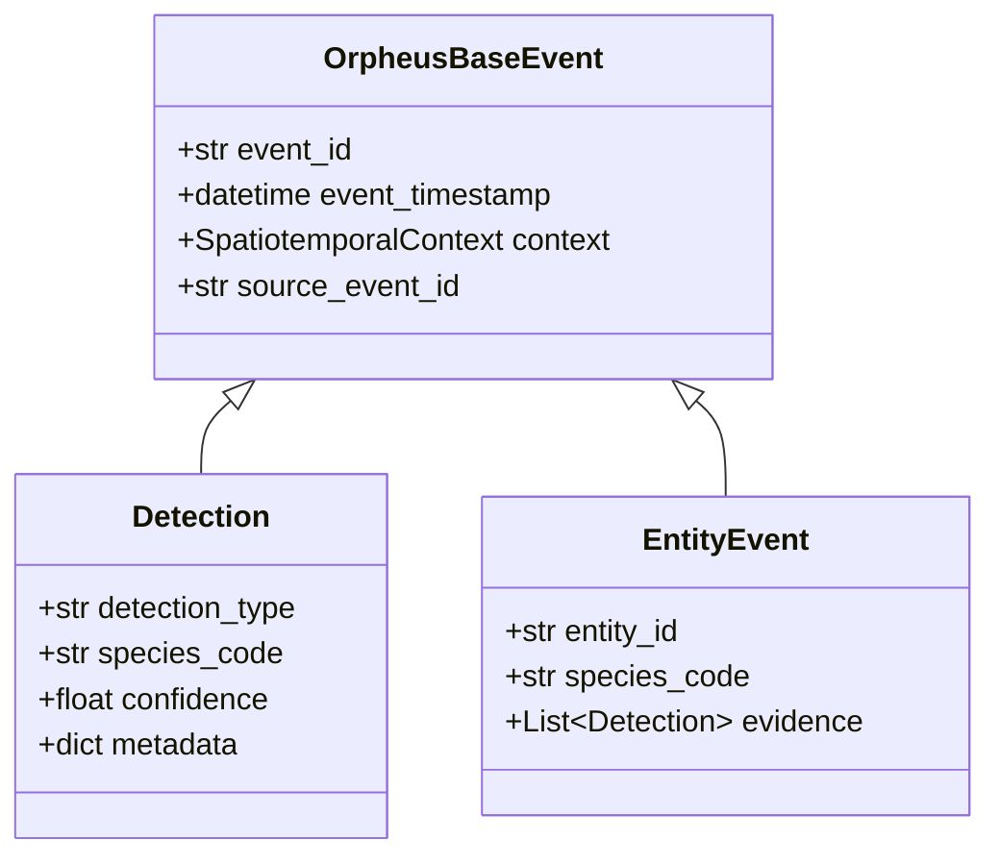

# ADR 0006: Event Hierarchy and Taxonomy

**Status:** Accepted

**Date:** 2026-02-15

**Deciders:** Development Team

## Context

The Orpheus event pipeline is fragmented. Agents define their own implicit data
models, which leads to:

1. **Crashes:** The Crow agent emitted raw dicts that could fail validation in
   downstream consumers such as the Event Correlator.
2. **Silent failures:** The Correlator ignored Bird events because it expected
   sub-detections exclusively inside `metadata.detections`, while legacy BirdNET
   payloads placed them at the root level.
3. **No single source of truth:** There was no formal document describing how
   `AudioMotion`, `Detection`, and `Entity` events relate.

ADR-0005 introduced `OrpheusBaseEvent` and the JSON sidecar
persistence pattern. This ADR extends that work by formalising the **complete
event hierarchy**, promoting causal lineage (`source_event_id`) to the base
class, flattening the hierarchy by removing the intermediate `InferenceEvent`
class, defining the standard `detection_type` taxonomy, and mandating that all
agents use `orpheus_common` models exclusively.

## Decision

### 1. Event Hierarchy

All events **must** inherit from `OrpheusBaseEvent` (defined in
`orpheus_common.events`) or use the `Detection` model (defined in
`orpheus_common.detection`). No agent may define its own event class.

### 2. Detection-Type Taxonomy

| `detection_type` | Producer | Description |
| --- | --- | --- |
| `audio.motion` | orpheus-agent-audio-motion | Raw audio energy trigger |
| `species.detected` | orpheus-agent-bird-detection | BirdNET species classification |
| `crow.analyzed` | orpheus-agent-crow-detection | Crow behaviour analysis |

New agents **must** register their `detection_type` string in this table via a
follow-up ADR or PR update.

### 3. Agent Compliance Rules

- Agents **must** publish events using `Detection.model_dump(mode="json")`.
- Agents **must not** construct raw dicts for MQTT payloads when a Pydantic
  model exists in `orpheus_common`.
- The Event Correlator **must** handle both legacy (root-level `detections`)
  and V2 (metadata-level `detections`) schemas to avoid dropping events during
  the migration window.

### 4. Centralised Site Configuration

Location data (latitude, longitude, elevation) is centralised in
`OrpheusConfig.site` (`SiteConfig` dataclass). Agents and services that need
location must read from this config rather than defining their own location
fields.

## Consequences

### Positive

- Single source of truth for event models in `orpheus_common`.
- Crow agent no longer emits invalid JSON that crashes the Correlator.
- Correlator processes both Bird and Crow events correctly.
- Location config is DRY — defined once in `orpheus.yaml`.

### Negative

- Existing agents require migration to use `Detection.model_dump()`.
- Correlator must maintain backward-compatible parsing during the transition.

### Risks

- Agents deployed before the migration will still emit legacy payloads. The
  Correlator's dual-schema parsing mitigates this.
