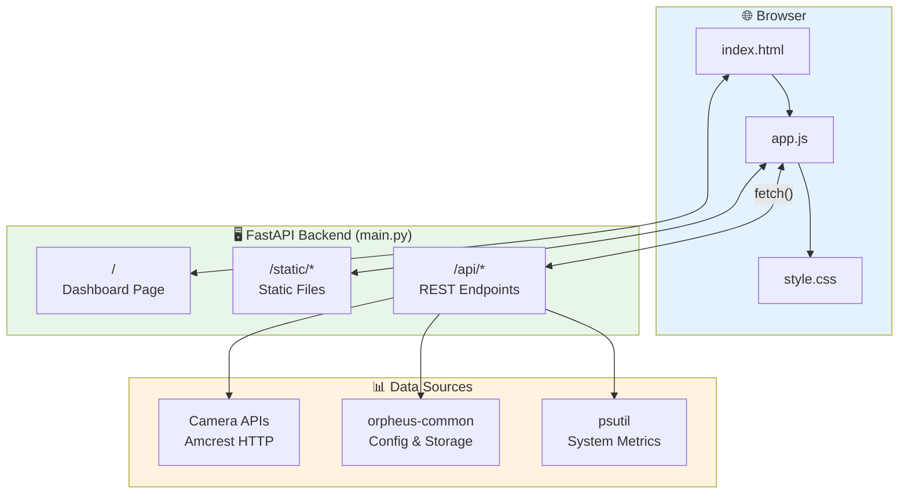
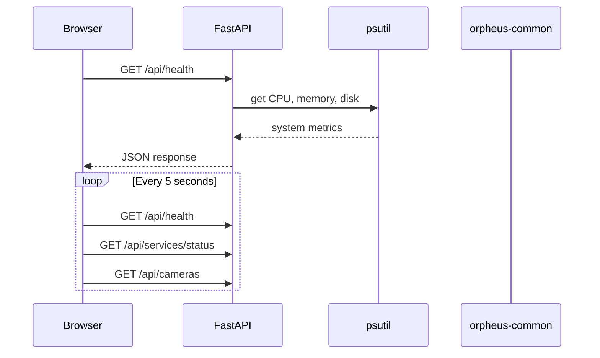

# Orpheus Dashboard

Diagnostic web interface for the Orpheus wildlife monitoring station.

## Quick Start

```bash
# Install dependencies
make install

# Run locally (development mode)
make run

# Open browser to http://localhost:8080
```

## What Works Now

- ✅ System health monitoring (CPU, memory, disk, uptime)
- ✅ Service status placeholders (all show "unknown" - expected)
- ✅ Camera monitoring and snapshot retrieval
- ✅ Audio system health diagnostics (via MQTT)
- ✅ Video system health diagnostics (via MQTT)
- ✅ Audio motion detection tracking
- ✅ Video motion detection tracking
- ✅ **Bird detection tracking (BirdNET integration)**
- ✅ **Crow behavioral analysis (crow-tools integration) - NEW: Shows behavioral context!**
- ✅ **Event traceability - Source event tracking for debugging**
- ✅ Audio playback control
- ✅ Auto-refresh every 5 seconds
- ✅ Retro terminal aesthetic (green-on-black)
- ✅ Production deployment via systemd

## What's Coming Next

- Hardware validation (cameras, audio, bluetooth)
- MQTT broker integration for service status
- Detection counts and statistics
- Real-time updates via Server-Sent Events
- Historical data visualization

## Development

```bash
make install    # Set up venv and install dependencies
make run        # Run with auto-reload on port 8080
make test       # Run tests
make clean      # Clean build artifacts and venv
```

The development server runs with auto-reload, so changes to Python files will automatically restart the server.

## Production Deployment

### Initial Installation

```bash
sudo make install-service   # Install to /opt/orpheus/dashboard
sudo systemctl enable orpheus-dashboard  # Enable auto-start on boot
sudo make service-start     # Start the service
```

### Managing the Service

```bash
./update_and_redeploy.sh    # update the service installation and redeploy (for use on the jetson)
make service-start          # Start service
make service-stop           # Stop service
make service-restart        # Restart service
make service-status         # Check status
make service-logs           # View logs (follows log output)
```

### Updating Code

After making changes to the code:

```bash
make update    # Stops service, copies new code, restarts service
```

This is your main workflow for deploying updates to production.

## Camera Configuration

The dashboard supports multiple IP cameras (currently Amcrest) configured via environment variables.

### Quick Start

1. Copy the example configuration:
   ```bash
   cp config/env.example .env
   ```
2. Edit `.env` with your camera details and credentials.
3. Restart the application.

### Supported Cameras

- **Amcrest**: IP5M series and compatible (requires HTTP API access)

### Adding Cameras

Edit your configuration file (`.env` for dev, `/etc/orpheus/dashboard/cameras.env` for prod) to add cameras:

```ini
CAMERA_1_TYPE=amcrest
CAMERA_1_NAME=front-gate
CAMERA_1_HOST=192.168.1.101
```

See `config/README.md` for detailed configuration instructions.

## Port Configuration

**Development:** Runs on port 8080 (no special permissions needed)  
**Production:** Runs on port 8080 by default

### Using Port 80 (Optional)

For production deployments where you want to access the dashboard without typing `:8080`, use nginx as a reverse proxy:

```bash
sudo apt install nginx

# Create nginx config
sudo tee /etc/nginx/sites-available/orpheus-dashboard << 'EOF'
server {
    listen 80;
    server_name jetson1.local localhost;

    location / {
        proxy_pass http://localhost:8080;
        proxy_set_header Host $host;
        proxy_set_header X-Real-IP $remote_addr;
        proxy_set_header X-Forwarded-For $proxy_add_x_forwarded_for;
    }
}
EOF

# Enable and restart
sudo ln -s /etc/nginx/sites-available/orpheus-dashboard /etc/nginx/sites-enabled/
sudo nginx -t
sudo systemctl restart nginx
```

Now access at `http://jetson1.local` (no port number needed).

## Architecture



### Request Flow



### Tech Stack

- **Backend**: FastAPI serving JSON endpoints
- **Frontend**: Vanilla JavaScript with polling (no framework dependencies)
- **Deployment**: Systemd service on Jetson
- **Styling**: Retro terminal aesthetic (Courier New, green-on-black)

The frontend polls API endpoints every 5 seconds and updates the UI. No websockets or SSE yet (coming in future versions).

### MQTT Topics

**Subscribes to:** Nothing directly.

**Publishes to:** `orpheus/audio/playback/request` (via `POST /api/audio/playback/play` — the backend publishes this on behalf of the user).

The dashboard does not subscribe to any MQTT topics. Detection data is read from DetectionDB (SQLite) via `orpheus-common`. The playback endpoint is the single case where the backend publishes to MQTT — it forwards the user's play request to `orpheus-agent-audio-playback`.

## API Endpoints

### Current

- `GET /` - Dashboard HTML page
- `GET /api/config` - Frontend configuration (poll interval)
- `GET /api/health` - System health metrics (CPU, memory, disk, uptime)
- `GET /api/services/status` - Service status list
- `GET /api/system/storage/data` - External storage usage
- `GET /api/cameras` - Camera health status
- `GET /api/cameras/{name}/snapshot` - Get latest camera snapshot
- `GET /api/hardware/storage` - Storage hardware information
- `GET /api/diagnostics/audio` - Audio system health diagnostics
- `GET /api/diagnostics/video` - Video system health diagnostics
- `GET /api/diagnostics/audio/detections` - Recent audio motion detections
- `GET /api/diagnostics/video/detections` - Recent video motion detections
- **`GET /api/diagnostics/bird/detections` - Recent bird detections (BirdNET)**
- **`GET /api/diagnostics/crow/detections` - Recent crow analysis (crow-tools)**
- `GET /api/audio/clips/{channel_id}/{filename}` - Download audio clip
- `GET /api/video/clips/{camera_id}/{filename}` - Download video clip
- `GET /api/audio/playback/sounds` - List available sounds for playback
- `POST /api/audio/playback/play` - Request audio playback
- `GET /api/debug/config` - Runtime configuration for debugging

### Coming Soon

- Historical data visualization
- Detection statistics and trends
- Alert notifications for specific species
- Audio spectrogram visualization

## Project Structure

```bash
orpheus-dashboard/
├── Makefile              # Build and deployment automation
├── requirements.txt      # Python dependencies
├── README.md            # This file
├── src/
│   └── main.py          # FastAPI application
├── static/              # Frontend files
│   ├── index.html       # Main dashboard page
│   ├── app.js           # Frontend logic
│   └── style.css        # Retro terminal styling
├── systemd/
│   └── orpheus-dashboard.service  # Systemd unit file
└── tests/               # Tests (coming soon)
```

## Development Tips

### Testing the API Directly

```bash
# System health
curl http://localhost:8080/api/health

# Service status
curl http://localhost:8080/api/services/status
```

### Viewing Logs During Development

```bash
# Run in one terminal
make run

# In another terminal, watch logs
tail -f /var/log/syslog | grep orpheus
```

### Quick Reload Workflow

The `make run` command uses uvicorn's `--reload` flag, so just save your Python files and the server will automatically restart. For frontend changes (HTML/JS/CSS), just refresh your browser.

## Troubleshooting

**Port 80 permission denied:**

- Don't run `make run` as root
- Use port 8080 for development
- Use nginx reverse proxy for production port 80 access

**Service won't start:**

```bash
make service-status    # Check what's wrong
make service-logs      # View detailed logs
```

**Can't access from another machine:**

- Make sure you're using `0.0.0.0` not `localhost` in the uvicorn command
- Check firewall: `sudo ufw allow 8080`

**After `make update`, changes not reflected:**

- The update copies files to `/opt/orpheus/dashboard/`
- Check you're editing the right files (not the production copies)
- Verify files were copied: `ls -la /opt/orpheus/dashboard/src/`

## Contributing

When adding new features:

1. Add API endpoint to `src/orpheus_dashboard/main.py`
2. Add frontend logic to `src/orpheus_dashboard/static/app.js`
3. Update styling in `src/orpheus_dashboard/static/style.css` if needed
4. Test locally with `make run`
5. Deploy with `make update`
6. Update this README with new endpoints/features

Keep the retro terminal aesthetic! Green-on-black is our brand. 🟢⬛

## Bird and Crow Detection Features

The dashboard displays real-time bird detections and crow analysis results from the Orpheus monitoring system.

### Bird Detections Panel

Shows bird species identified by BirdNET from audio recordings:

- **Per-channel summary cards**: Shows last detection time and species count for each audio channel (1-4)
- **Expandable history**: Click on a channel card to view detailed detection history
- **Species information**: Displays common name, confidence score, and event ID
- **Color-coded status**: Green (recent), yellow (30min+), gray (no activity)

### Crow Analysis Panel

Shows detailed crow behavior analysis from the crow-tools AI model:

- **Behavioral Classification**: The model is a **behavioral classifier**, not just species identification
- **Per-channel summary cards**: Shows last analysis time and dominant behavior (e.g., ⚠️ Alert, 🔊 Rattle)
- **Expandable history**: Click on a channel card to view detailed analysis history
- **Behavior indicators with probabilities**:
  - ⚠️ **Alert** - Warning/contact calls (confidence shown)
  - 🍴 **Begging** - Juvenile food requests
  - 🎵 **Soft Song** - Quiet social vocalizations (subsong)
  - 🔊 **Rattle** - Aggressive rattling display
  - ⚔️ **Mob** - Mobbing behavior (group aggression)
- **Call Type**: Displays the dominant behavior as the primary classification
- **Quality Score**: Model confidence that this is actually crow vocalization (0-100%)
- **Event Traceability**: Shows "Source Event" column to track which Bird detection triggered each analysis
- **Color-coded status**: Green (recent), yellow (30min+), gray (no activity)

#### Understanding the Behavioral Model

The crow classifier uses a multi-task neural network trained on labeled crow vocalizations. It outputs:

1. **Quality**: Confidence this is a crow (vs noise or other bird)
2. **Call Type**: The dominant behavior category
3. **Attributes**: Probabilities for each behavior (alert, begging, soft_song, rattle, mob)
4. **Age**: Adult or juvenile classification

This allows us to understand **what crows are communicating**, not just that they're present.

#### Event Pipeline & Traceability

The detection system follows a clear pipeline:

1. **Audio Motion** → Detects sound activity (orpheus-agent-audio-motion)
2. **Bird Detection** → Identifies species using BirdNET (orpheus-agent-bird-detection)
3. **Crow Analysis** → Analyzes crow behaviors using crow-tools (orpheus-agent-crow-detection)

Each event includes a `source_event_id` that links back to the previous stage, enabling full traceability for debugging.

### Data Sources

The dashboard receives detection data via MQTT:

- **Bird detections**: Published to `orpheus/detection/bird/events` by the bird-detection agent
- **Crow analysis**: Published to `orpheus/detection/crow/events` by the crow-detection agent

See `/docs/Orpheus_Standard_Data_Models.md` for complete data structure specifications.

### Testing Detection Features

To test the bird and crow detection panels with sample data:

```bash
# Ensure MQTT broker is running
sudo systemctl status mosquitto

# Run the test script from the dashboard directory
cd services/orpheus-dashboard
python3 scripts/test_bird_crow_detections.py

# Open dashboard to see test data
# http://localhost:8080
```

The test script simulates the **full detection pipeline** with proper event lineage:

1. **Audio Motion Events**: Simulates noise detection on all 4 channels
2. **Bird Detection Events**: Simulates species identification (American Crow + Blue Jay)
3. **Crow Analysis Events**: Simulates behavioral analysis on channels 1 and 3

Each event includes a `source_event_id` linking to the triggering event, allowing you to trace the complete detection chain in the dashboard's "Source Event" column.

## Performance Notes

- psutil calls have minimal overhead (~1-5ms)
- Frontend polling every 5 seconds is lightweight
- No database required (reads system state directly)
- Runs comfortably on Jetson with <1% CPU usage

For a field research station, this is perfect. We're monitoring the monitor! 🐦‍
